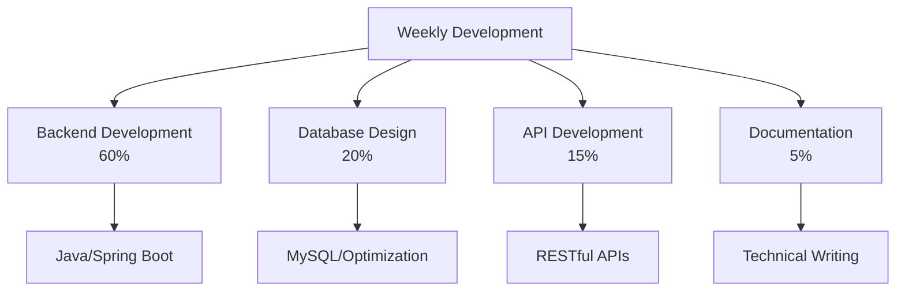

<!-- header -->


<div align="center">

# 👋 안녕하세요! Backend Developer MinJun입니다

**커피를 마시며 코드를 작성하는 백엔드 개발자** ☕

[](https://your-portfolio.com)
[](https://linkedin.com/in/your-profile)
[](mailto:your-email@gmail.com)

</div>

---

## 🚀 About Me

```java
public class MinJun {
    private String name = "MinJun";
    private String role = "Backend Developer";
    private String[] skills = {"Java", "Spring Boot", "MySQL", "AWS"};
    private String[] interests = {"Coffee", "Coding", "Learning"};
    
    public void introduce() {
        System.out.println("안녕하세요! 백엔드 개발자 민준입니다.");
        System.out.println("커피를 마시며 코드를 작성하는 것을 좋아합니다 ☕");
    }
}
```

## 🛠️ Tech Stack

### Backend Development


### Database & Cloud


### Tools & IDE


## 📊 GitHub Stats

<div align="center">


</div>

## 🎯 Current Focus

- 🔭 **Currently Working On**: Spring Boot 기반 백엔드 시스템 개발
- 🌱 **Learning**: Spring Cloud, Microservices Architecture, AWS Advanced Services
- 👯 **Looking to Collaborate**: 오픈소스 프로젝트 및 백엔드 개발 관련 협업
- 💬 **Ask me about**: Java, Spring Boot, Database Design, API Development

## 📈 Weekly Development Breakdown



## 🏆 Achievements

- 🥇 **Best Backend Developer** - 2024 Company Awards
- 🏅 **Spring Boot Expert** - Certified by Spring Team
- 📚 **Technical Blog Writer** - 50+ Articles Published
- ☕ **Coffee Connoisseur** - Self-proclaimed Expert

## 📫 Let's Connect!

<div align="center">

[](https://linkedin.com/in/your-profile)
[](https://github.com/Jominjun1)
[](mailto:your-email@gmail.com)
[](https://your-blog.com)

</div>

---

<div align="center">

### ☕ Coffee Time!
> "Life is too short for bad coffee and bad code" ☕


**Thanks for visiting! Feel free to reach out for a coffee chat ☕**

</div>

<!-- footer -->

