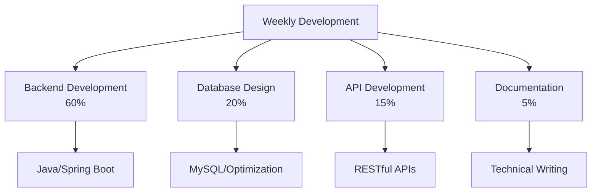

<div align="center">
<!-- header -->


</div>

<div align="center">

# 👋 안녕하세요! 백엔드 개발자 조민준입니다.

**커피를 마시면서 집중하는 백엔드 개발자** ☕

[](mailto:simpers@naver.com.com)

</div>

---

## 🚀 About Me

```java
public class MinJun {
    private String name = "MinJun";
    private String role = "Backend Developer";
    private String[] skills = {"Java", "Spring Boot", "MySQL", "MariaDB", "Oracle", "AWS"};
    private String[] interests = {"Coffee", "Coding", "Learning"};
    
    public void introduce() {
        System.out.println("안녕하세요! 백엔드 개발자 민준입니다.");
        System.out.println("커피를 마시며 코드를 작성하는 것을 좋아합니다 ☕");
    }
}
```

## 🗂️ Portfolio Projects

---

### ☕ CoffeeAnalyze ( 개인 프로젝트 )
- **설명**: 다양한 커피 브랜드의 메뉴를 비교·분석할 수 있는 웹 애플리케이션
- **주요 기술**: Spring Boot, Java, MySQL, Vue.js, Node.js
- [상세정보 보러가기](https://github.com/Jominjun1/CoffeeAnalyze)

---

### 🍽️ FoodfixProject ( 팀 프로젝트- 백엔드 담당 )
- **설명**: 포장/예약 주문과 매장 관리를 위한 웹/앱 서비스 (2024 캡스톤 장려상)
- **주요 기술**: Spring Boot, Java, MySQL, AWS RC2, AWS EC2 [백엔드], React, Swift, Kotlin [프론트]
- [상세정보 보러가기](https://github.com/Jominjun1/FoodfixProject)
- [백엔드 코드](https://github.com/Jominjun1/FoodfixProject/tree/spring)

---

### 🎮 DodgeGame ( 팀 프로젝트 - 게임 로직 및 서버 개발 담당 )
- **설명**: Java Swing 기반 멀티플레이어 탄막 피하기 게임
- **주요 기술**: Java, Swing, Socket API
- [상세정보 보러가기](https://github.com/Jominjun1/DodgeGame)

---

### 🃏 BlackJack Card Game ( 팀 프로젝트 - 게임 로직 및 UI 설계 담당 )
- **설명**: Java Swing 기반 블랙잭 카드 게임, 배경음악/승률/자동 셔플 등 다양한 기능 구현
- **주요 기술**: Java, Swing, AWT, JLayer
- [상세정보 보러가기](https://github.com/Jominjun1/BlackJackCardGame)

---

### 🏷️ TEIA 인트라넷 개발 ( 회사 프로젝트 - 백엔드 개발 담당 )
- **설명**: 스마트 태그의 생명주기 전반을 관리하는 사내 인트라넷 시스템 (재고관리, AS이력, 프로젝트관리, 일일보고서)
- **주요 기술**: Spring Boot, Java 21, Spring Security, JWT, MariaDB, Vue.js, Element Plus
- **핵심 기능**: 태그 재고관리, 처리단계 추적, AS이력관리, 버전관리, 사용자인증, 프로젝트관리, 일일보고서
- [상세정보 보러가기](https://github.com/Jominjun1/TAG_DEV)

## 🛠️ Tech Stack

### Backend Development


### Database & Cloud


### Frontend & Tools


## 📊 GitHub Stats

<div align="center">


</div>

## 🎯 Current Focus

- 🔭 **Currently Working On**: Spring Boot 기반 백엔드 시스템 개발
- 🌱 **Learning**: Spring Cloud, Microservices Architecture, AWS Advanced Services
- 👯 **Looking to Collaborate**: 오픈소스 프로젝트 및 백엔드 개발 관련 협업
- 💬 **Ask me about**: Java, Spring Boot, Database Design, API Development

## 📈 Weekly Development Breakdown



<div align="center">
<!-- footer -->


</div>
